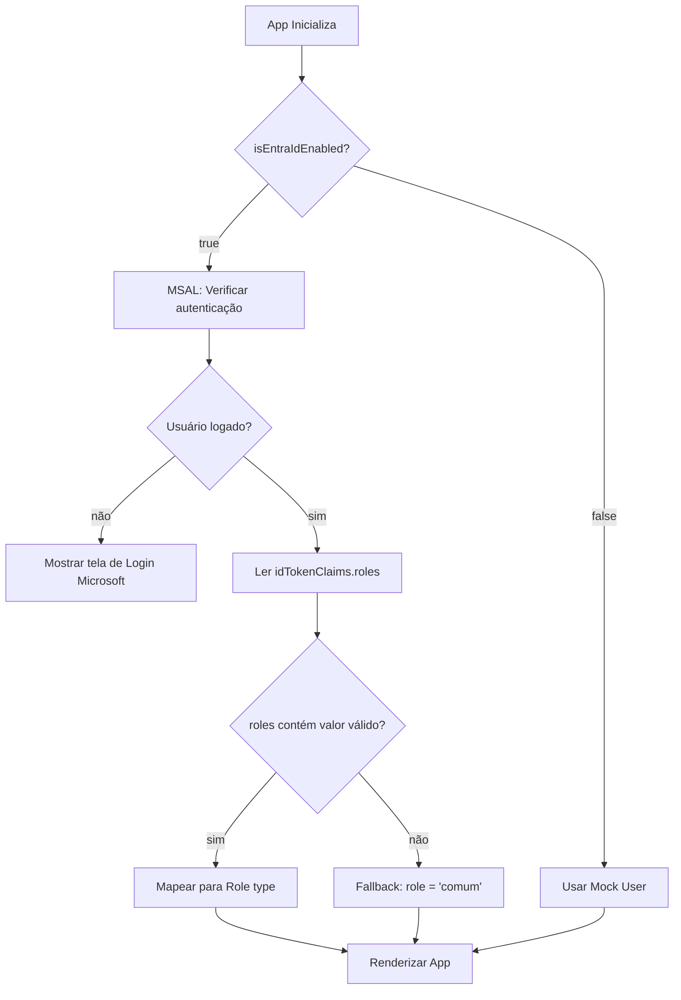

# Integração Microsoft Entra ID — Plano de Implementação

Substituir o `MockAuthContext` pela autenticação real com Microsoft Entra ID via `@azure/msal-react`, mantendo a capacidade do administrador de alternar para Mock em ambiente de desenvolvimento.

## User Review Required

> [!IMPORTANT]
> **Antes de iniciar a implementação, preciso dos seguintes dados do seu portal Entra ID:**
> 1. **Client ID** (Application ID) — obtido na App Registration
> 2. **Tenant ID** (Directory ID) — obtido na App Registration
> 3. Se o app é **single-tenant** ou **multi-tenant**

> [!WARNING]
> A DevToggleBar será **removida** do footer em produção. Em dev, um botão "Mock Mode" ficará disponível apenas para administradores no painel admin.

---

## Proposed Changes

### Dependências

#### [MODIFY] [package.json](file:///c:/Users/duart/OneDrive/Desktop/CRM%20Antigravity%20controle/CRM%20Antigravity/Antigravity-CRM/frontend/package.json)

Adicionar dependências MSAL:
```diff
 "dependencies": {
+  "@azure/msal-browser": "^4.12.0",
+  "@azure/msal-react": "^2.5.0",
   "@radix-ui/react-slot": "^1.2.4",
```

---

### Configuração MSAL

#### [NEW] [authConfig.ts](file:///c:/Users/duart/OneDrive/Desktop/CRM%20Antigravity%20controle/CRM%20Antigravity/Antigravity-CRM/frontend/authConfig.ts)

Arquivo de configuração centralizado do MSAL:

```typescript
import { Configuration, LogLevel } from '@azure/msal-browser';

export const msalConfig: Configuration = {
  auth: {
    clientId: import.meta.env.VITE_ENTRA_CLIENT_ID || '',
    authority: `https://login.microsoftonline.com/${import.meta.env.VITE_ENTRA_TENANT_ID || 'common'}`,
    redirectUri: window.location.origin,
    postLogoutRedirectUri: window.location.origin,
  },
  cache: {
    cacheLocation: 'localStorage',
    storeAuthStateInCookie: false,
  },
  system: {
    loggerOptions: {
      logLevel: import.meta.env.DEV ? LogLevel.Warning : LogLevel.Error,
    },
  },
};

export const loginRequest = {
  scopes: ['User.Read', 'openid', 'profile', 'email'],
};
```

Variáveis de ambiente via `.env`:
```
VITE_ENTRA_CLIENT_ID=<seu-client-id>
VITE_ENTRA_TENANT_ID=<seu-tenant-id>
```

---

### Refatoração do AuthContext

#### [MODIFY] [MockAuthContext.tsx](file:///c:/Users/duart/OneDrive/Desktop/CRM%20Antigravity%20controle/CRM%20Antigravity/Antigravity-CRM/frontend/contexts/MockAuthContext.tsx) → Renomear para `AuthContext.tsx`

O novo `AuthContext` terá **dois modos**:

| Modo | Quando ativo | Como funciona |
|---|---|---|
| **Entra ID (Real)** | `isEntraIdEnabled === true` | Lê `user` e `roles` do token MSAL via `useMsal()` |
| **Mock (Dev)** | `isEntraIdEnabled === false` | Comportamento atual — presets de perfis para testes |

**Fluxo de decisão:**



**Interface do contexto permanece a mesma** (`useAuth()` retorna os mesmos campos). Nenhum componente consumidor precisa mudar.

**Mapeamento de roles do token:**

```typescript
// Token JWT → claim "roles" → array de strings
// Mapeamento direto: o Value da App Role no Entra = o valor do type Role

const mapTokenRoles = (tokenRoles: string[] | undefined): Role[] => {
  const validRoles: Role[] = ['administrador', 'risco', 'gestor', 'diretor_presidente', 'analista', 'comum'];
  const mapped = (tokenRoles || []).filter(r => validRoles.includes(r as Role)) as Role[];
  return mapped.length > 0 ? mapped : ['comum']; // fallback
};
```

---

### Entry Point

#### [MODIFY] [index.tsx](file:///c:/Users/duart/OneDrive/Desktop/CRM%20Antigravity%20controle/CRM%20Antigravity/Antigravity-CRM/frontend/index.tsx)

```diff
 import React from 'react';
 import ReactDOM from 'react-dom/client';
+import { PublicClientApplication } from '@azure/msal-browser';
+import { MsalProvider } from '@azure/msal-react';
 import App from './App';
-import { MockAuthProvider } from './contexts/MockAuthContext';
-import DevToggleBar from './components/DevToggleBar';
+import { AuthProvider } from './contexts/AuthContext';
+import { msalConfig } from './authConfig';
+
+const msalInstance = new PublicClientApplication(msalConfig);

 const root = ReactDOM.createRoot(rootElement);
 root.render(
   <React.StrictMode>
-    <MockAuthProvider>
-      <App />
-      <DevToggleBar />
-    </MockAuthProvider>
+    <MsalProvider instance={msalInstance}>
+      <AuthProvider>
+        <App />
+      </AuthProvider>
+    </MsalProvider>
   </React.StrictMode>
 );
```

---

### Tela de Login

#### [NEW] [LoginPage.tsx](file:///c:/Users/duart/OneDrive/Desktop/CRM%20Antigravity%20controle/CRM%20Antigravity/Antigravity-CRM/frontend/components/LoginPage.tsx)

Componente renderizado quando o modo Entra ID está ativo e o usuário não está autenticado:
- Logo da Antigravity
- Botão "Entrar com Microsoft"
- Chama `instance.loginRedirect(loginRequest)`
- Estilo premium: glassmorphism, gradientes, animações sutis

---

### Painel Administrador

#### [NEW] [AdminPanel.tsx](file:///c:/Users/duart/OneDrive/Desktop/CRM%20Antigravity%20controle/CRM%20Antigravity/Antigravity-CRM/frontend/components/AdminPanel.tsx)

Acessível apenas por administradores (via `hasRole('administrador')`):

| Funcionalidade | Detalhes |
|---|---|
| **Toggle Entra ID / Mock** | Switch para ativar/desativar autenticação real. Persistido em `localStorage`. |
| **Gerenciar Roles** | Seletor de perfils e roles (funciona apenas no modo Mock). |
| **Informações do Usuário** | Mostra dados do token atual: nome, email, roles, tenant. |

> O painel será acessível via ícone de engrenagem no header ou sidebar (apenas para admin).

---

### Componentes a Atualizar (imports)

Os seguintes arquivos importam `useAuth` de `MockAuthContext` e precisam atualizar o import path:

| Arquivo | Mudança |
|---|---|
| [Sidebar.tsx](file:///c:/Users/duart/OneDrive/Desktop/CRM%20Antigravity%20controle/CRM%20Antigravity/Antigravity-CRM/frontend/components/Sidebar.tsx) | `'../contexts/MockAuthContext'` → `'../contexts/AuthContext'` |
| [ComiteDetailPage.tsx](file:///c:/Users/duart/OneDrive/Desktop/CRM%20Antigravity%20controle/CRM%20Antigravity/Antigravity-CRM/frontend/components/ComiteDetailPage.tsx) | idem |
| [ComiteVideoPage.tsx](file:///c:/Users/duart/OneDrive/Desktop/CRM%20Antigravity%20controle/CRM%20Antigravity/Antigravity-CRM/frontend/components/ComiteVideoPage.tsx) | idem |

---

### Arquivo a Remover

#### [DELETE] [DevToggleBar.tsx](file:///c:/Users/duart/OneDrive/Desktop/CRM%20Antigravity%20controle/CRM%20Antigravity/Antigravity-CRM/frontend/components/DevToggleBar.tsx)

A funcionalidade de toggle será absorvida pelo `AdminPanel`.

---

## Open Questions

> [!IMPORTANT]
> **1. Você já configurou o App Registration no Entra Admin Center?**
> Se sim, me forneça o Client ID e Tenant ID para eu colocá-los no `.env`.
> Se não, siga o [guia que criei](file:///C:/Users/duart/.gemini/antigravity/brain/3cec89aa-a38e-4d74-9a34-220c8c2af4bb/guia_entra_id.md) primeiro.

> [!IMPORTANT]
> **2. O AdminPanel deve ter uma página/rota própria ou ser um modal acessível pelo header?**
> Minha sugestão: Modal acessível pelo ícone ⚙️ no header (apenas visível para admin).

> [!WARNING]
> **3. Sobre o "Modo Mock como fallback":**
> O admin poderá desativar o Entra ID e voltar ao Mock diretamente pelo painel. Isso permite testes em dev **sem** credenciais Microsoft. Confirma que esse comportamento está ok para vocês?

## Verification Plan

### Automated Tests
- `npm run lint` — verificar que não há erros de tipagem TypeScript
- `npm run test:backend` — garantir que testes de backend continuam passando (backend não muda)

### Manual Verification
1. **Modo Mock (Entra ID desativado):** Verificar que toda UI continua funcionando como antes
2. **Modo Entra ID (ativado):**
   - Sem login → tela de login aparece
   - Login Microsoft → redireciona de volta com token
   - Token com `roles: ['administrador']` → painel admin visível
   - Token com `roles: ['analista']` → apenas funcionalidades de analista
   - Token sem roles → tratado como `'comum'` (read-only)
3. **Votação comitê:** Testar que `canVote` funciona com roles reais do token
4. **AdminPanel:** Testar toggle Entra ID ↔ Mock
